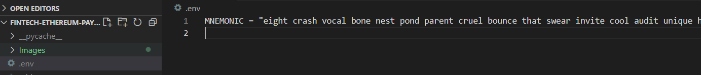
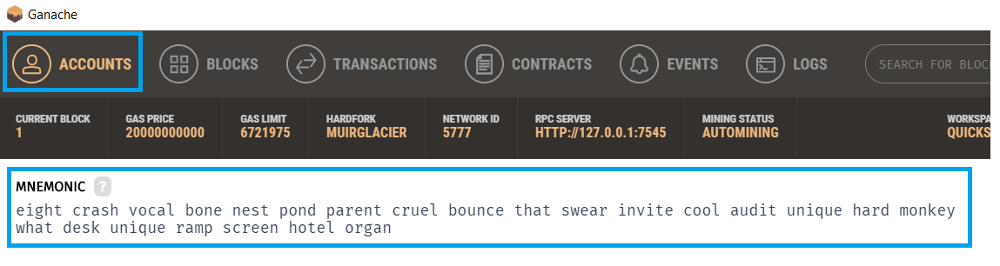
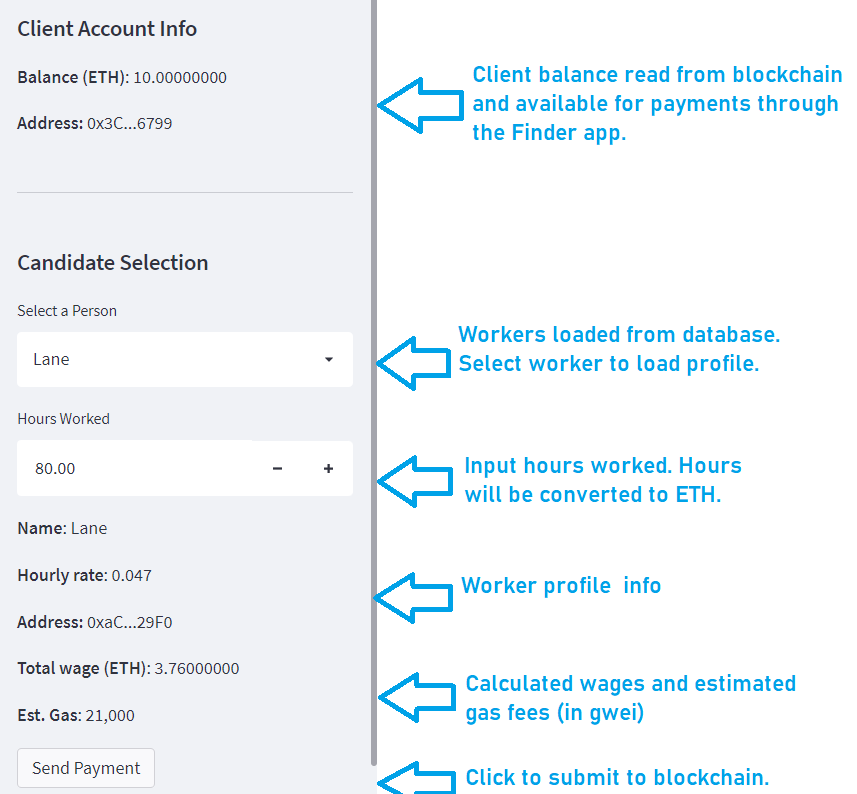
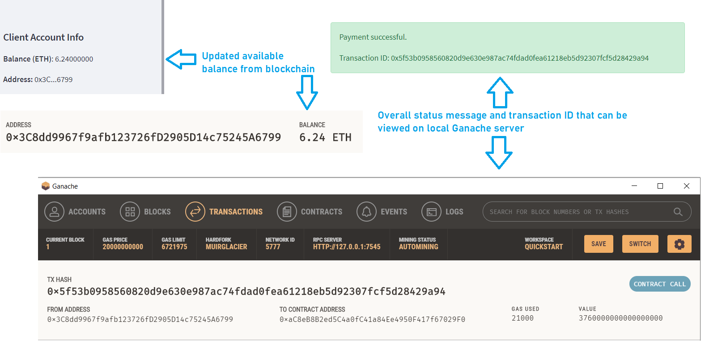
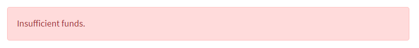

# Ethereum Payment System (Fintech Finder)

This repo demonstrates programming against the Ethereum blockchain. It automates tasks associated with generating a digital wallet; accessing Ethereum account balances; estimating and calculating gas fees; and signing and sending transactions.  For this demo the provider is a personal Ethereum blockchain hosted locally using Ganache.

## Technologies

The application uses the following technologies:

- [Python 3.7](https://www.python.org)
- [streamlit](https://streamlit.io)
- [Web3.py](https://web3py.readthedocs.io/en/stable/overview.html)
- [ethereum-tester](https://pypi.org/project/ethereum-tester/0.1.0a4/)
- [mnemonic](https://pypi.org/project/mnemonic/)
- [bip44](https://pypi.org/project/bip44/)
- [Ganache](https://www.trufflesuite.com/ganache)
- [python-env](https://pypi.org/project/python-dotenv/)

## Installation Guide

### Pip Packages

```python

pip install --upgrade pip
pip install web3==5.17
pip install eth-tester==0.5.0b3
pip install mnemonic
pip install bip44
pip install streamlit
pip install python-dotenv

```

### Ganache

For Ganache, follow the instructions on the [Ganache download page](https://www.trufflesuite.com/ganache) to download and install this tool on your local machine. Note Ganache must be running in order for the front-end to communicate with it.

### Secret Management

The demo requires a local environment file that contains the 24 word mnemonic for use with Ganache.  Perform the following configuration:

- Create an *.env* file at the same level as *fintech_finder.py*
- Within the .env file add a *MNEMONIC* key with the value being a space-separated seed phrase (see image below)



 Note that the mnemonic should match what is in the running Ganache server.

 

 NOTE: DO NOT USE THIS MNEMONIC PHRASE OR ANY MNEMONIC PHRASE YOU GENERATE IN GANACHE ON A REAL-WORLD BLOCKCHAIN.  MNEMONICS, OR SEED PHRASES, SHOULD NEVER BE SHARED.  THEY SHOULD ALSO BE STORED NON-DIGITALLY AND GENERATED ON AN AIR-GAPPED DEVICE.  THE SEED PHRASE IS THE BASIS FOR PRIVATE KEY GENERATION AND THAT PRIVATE KEY IS THE KEY THAT GRANTS ACCESS TO ALL FUNDS ON THE BLOCKCHAIN.  IT MUST BE PROTECTED JUST LIKE ONE'S BANKING PIN NUMBERS.

### Running the app

- Ensure Ganache is running
- Double-check there's an *.env* file present containing the *MNEMONIC* key with a value that matches the seed phrase in the running Ganache
- Open a terminal and navigate to the root directory of this project
- `streamlit run fintech_finder.py`

## Overview

### Objective

The objective of this tool is to demo the construction and sending of signed transactions on the Ethereum (ETH) blockchain.  You are a customer using the *Fintech Finder* app where you can select from a pool of candidates and pay them wages in ETH.

### Approach

When you set the hours for a particular worker, a transaction is constructed that converts the user's hours and hourly wages into wei, and then into ETH.  The wages, combined with the sender and receiver addresses are used to estimate transaction, or gas, fees using a *medium gas price strategy*.  From there the transaction is assembled and signed using the Ethereum account's private key that was derived from the mnemonic seed phrase.  The signed transaction is sent to the local Ethereum blockchain hosted on Ganache for processing.  A transaction ID is returned.  Ganache is configured as a provider for the Web3 object used in the demo.

## Workflow

- Review your account balance.  If more ETH is needed, configure it in the account settings in Ganache.
- Select the desired worker from the dropdown listbox.
- Enter the amount of hours to be paid for.
- Review the calculated wages in ETH and estimated gas fees.
- Click the **Send Payment** button. If wages exceed avaialable balance, an *Insufficient funds* message will be displayed.
- Review the status message.  If successful, review the transaction hash.
- Review the transaction corresponding to that hash in Ganache.

### App Quick Reference Guide

#### Sidebar configuration display and inputs



#### Successful transaction example



#### Insufficient funds example



## Contributors

- Jacob Rougeau

## License

MIT
